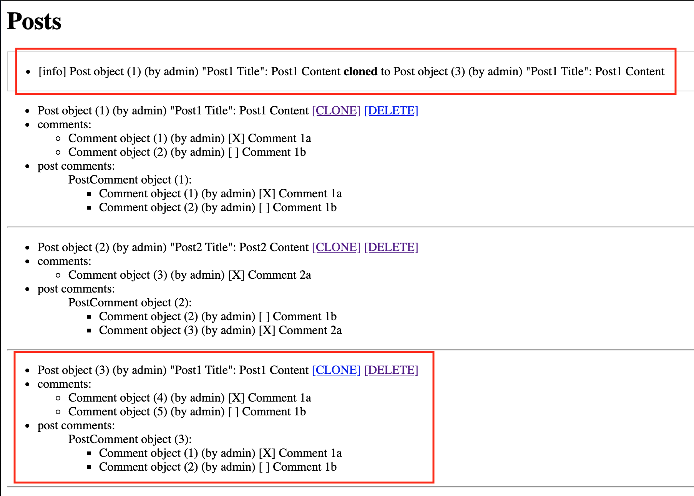
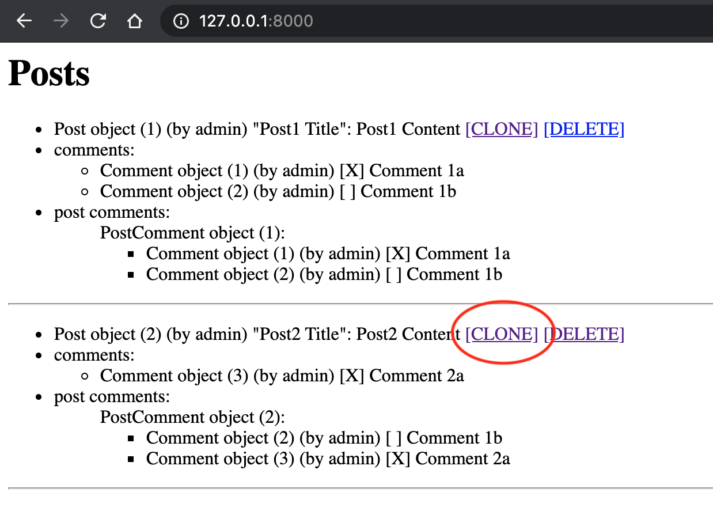
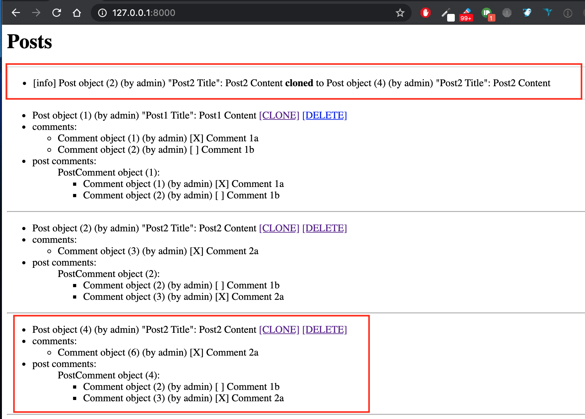

Solving "Django clone the recursive objects" (https://stackoverflow.com/questions/61584535/django-clone-the-recursive-objects)

Post objects can be cloned as follows:

.. code:: python

    from .clone_object import clone_object
    clone = clone_object(post)

Strategy
--------

    1) **def clone_object(obj, attrs={})** starts by build a "flat" clone of the given "obj"
    2) M2M fields are managed by replicating all related records found on parent "obj" into "clone"
    3) for 1-1 and 1-N relations, we clone all child objects by calling recursively **clone_object()**,
       but overridding the remote field with the new cloned object

Implementation
--------------

See `clone_object.py <./main/clone_object.py>`_

Example 1
---------

.. image:: screenshots/001.png

Example 2
---------

